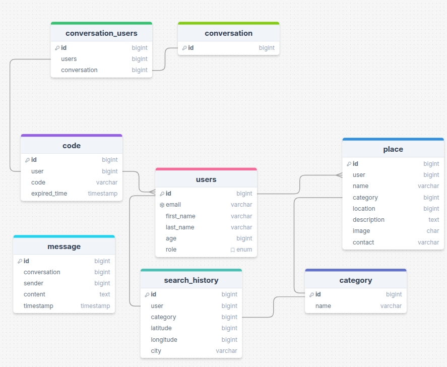

# Near Project – ER Diagram Tavsifi

Quyida Near loyihasidagi **Entity-Relationship (ER) diagramma** matnli tarzda UML uslubida tavsiflab berilgan. Bu tasvirlash shakli vizual diagrammadan foydalanmasdan, bog‘lanishlarni matn orqali tushunishga yordam beradi.

---

ER Diagram

---
## Asosiy Jadvallar va Bog‘lanishlar

### 1. **Users**

* `id` (PK)
* `email`
* `first_name`
* `last_name`
* `age`
* `role`

**Bog‘lanishlar:**

* 1\:N → `place` (bitta user ko‘plab joy qo‘shishi mumkin)
* 1\:N → `search_history` (bitta user bir nechta qidiruvlar qilishi mumkin)
* 1:1 → `code` (userga yagona verification code bog‘liq)
* N\:M → `conversation` (conversation\_users jadvali orqali)

---

### 2. **Place**

* `id` (PK)
* `user` (FK → users)
* `name`
* `category` (FK → category)
* `location`
* `description`
* `image`
* `contact`

**Bog‘lanishlar:**

* N:1 → `users`
* N:1 → `category`

---

### 3. **Category**

* `id` (PK)
* `name`

**Bog‘lanishlar:**

* 1\:N → `place` (bir kategoriya bir nechta joylarga tegishli bo‘lishi mumkin)

---

### 4. **Search\_History**

* `id` (PK)
* `user` (FK → users)
* `category`
* `latitude`
* `longitude`
* `city`

**Bog‘lanishlar:**

* N:1 → `users`

---

### 5. **Code**

* `id` (PK)
* `user` (FK → users)
* `code`
* `expired_time`

**Bog‘lanishlar:**

* 1:1 → `users`

---

### 6. **Conversation**

* `id` (PK)

**Bog‘lanishlar:**

* N\:M → `users` (conversation\_users jadvali orqali)
* 1\:N → `message` (conversationda ko‘plab xabarlar bo‘lishi mumkin)

---

### 7. **Conversation\_Users** (junction table)

* `id` (PK)
* `users` (FK → users)
* `conversation` (FK → conversation)

**Bog‘lanishlar:**

* N:1 → `users`
* N:1 → `conversation`

---

### 8. **Message**

* `id` (PK)
* `conversation` (FK → conversation)
* `sender` (FK → users)
* `content`
* `timestamp`

**Bog‘lanishlar:**

* N:1 → `conversation`
* N:1 → `users` (sender sifatida)

---

## Xulosa

Ushbu ER diagramma Near loyihasining **asosiy ma’lumotlar modeli**ni ifodalaydi. Foydalanuvchi markaziy obyekt sifatida tanlangan, u joy qo‘shishi, qidiruv qilishi, chatda ishtirok etishi va xabar yuborishi mumkin. Category esa joylarni tasniflash uchun xizmat qiladi. Conversation va Message jadvallari esa chat funksiyasini amalga oshirish uchun mo‘ljallangan.
