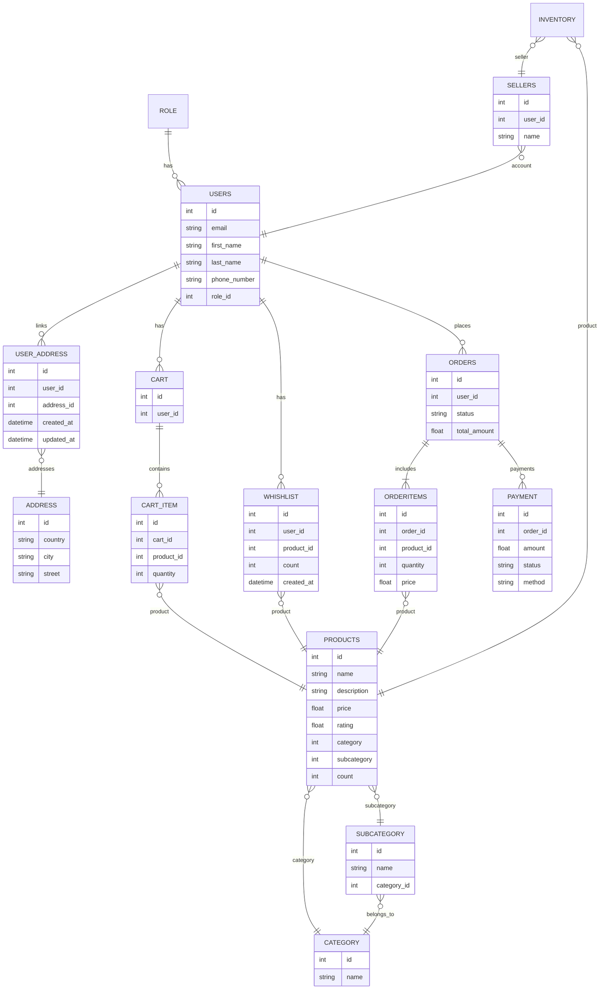
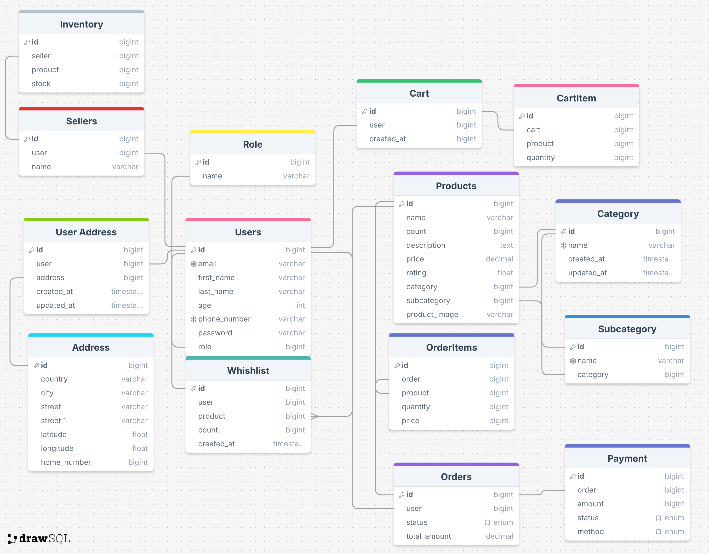

# ERD Hujjati – v1 va v2 taqqoslash

Quyida **v2 (yangilangan)** va **v1 (dastlabki)** sxemalar Mermaid.js `erDiagram` ko‘rinishida berilgan. Keyin qisqa izohlar va taqqoslash jadvali keltiriladi.

---

## 1) v2 – Yangilangan ERD (joriy variant)

```mermaid
erDiagram
  USERS ||--o{ ADDRESS : has
  USERS ||--o{ CART : has
  CART  ||--o{ CART_ITEM : contains
  CART_ITEM }o--|| PRODUCTS : product

  USERS ||--o{ WISHLIST : has
  WISHLIST }o--|| PRODUCTS : product

  USERS ||--o{ ORDERS : places
  ORDERS ||--|{ ORDER_ITEMS : includes
  ORDER_ITEMS }o--|| PRODUCTS : product

  ORDERS ||--o{ PAYMENT : payments
  ORDERS ||--o{ ORDER_STATUS_HISTORY : status_history
  ORDER_STATUS_HISTORY }o--o{ USERS : actor

  PRODUCTS }o--|| CATEGORY : category
  CATEGORY ||--o{ CATEGORY : parent

  INVENTORY }o--|| PRODUCTS : product
  INVENTORY }o--|| USERS : seller

  ROLE ||--o{ USERS : has

  USERS {
    int id
    string email
    string first_name
    string last_name
    string phone_number
    int role_id
  }

  ROLE {
    int id
    string name
  }

  ADDRESS {
    int id
    string country
    string city
    string street
    int user_id
  }

  CATEGORY {
    int id
    string name
    int parent
    datetime created_at
    datetime updated_at
  }

  PRODUCTS {
    int id
    string name
    string description
    float price
    float rating
    boolean is_active
    int category
  }

  CART {
    int id
    int user_id
    datetime created_at
  }

  CART_ITEM {
    int id
    int cart_id
    int product_id
    int quantity
  }

  WISHLIST {
    int id
    int user_id
    int product_id
    datetime created_at
  }

  ORDERS {
    int id
    int user_id
    string status
    float total_amount
    datetime created_at
  }

  ORDER_ITEMS {
    int id
    int order_id
    int product_id
    int quantity
    float price
  }

  PAYMENT {
    int id
    int order_id
    float amount
    string status
    string method
    datetime created_at
  }

  ORDER_STATUS_HISTORY {
    int id
    int order_id
    string from_status
    string to_status
    datetime at
    int by_user
  }

  INVENTORY {
    int id
    int seller
    int product
    int stock
  }

```

---

.png>)

---

**Qisqa izohlar (v2):**

* `CATEGORY` o‘zini-o‘zi `parent` bilan bog‘laydi → istalgan chuqurlikdagi ierarxiya.
* `INVENTORY.seller` — v2 da `USERS`ga ulanadi (seller roli bo‘lishi kerak). Istasangiz alohida `SELLERS` jadvalini qayta kiritish mumkin.
* `WISHLIST` set ko‘rinishida: odatda `(user_id, product_id)` noyob.
* `ORDER_ITEMS.price` — xarid paytidagi **birlik narx** snapshot.

---

## 2) v1 – Dastlabki ERD (oldingi variant)

---

---

**Qisqa izohlar (v1):**

* `CATEGORY` + `SUBCATEGORY` alohida; `PRODUCTS` ikkala ustunga ulanadi.
* `WHISHLIST` jadvali noto‘g‘ri yozilgan (Whishlist) va `count` ustuni mavjud.
* `USER_ADDRESS` alohida link jadvali sifatida ishlatilgan.
* `INVENTORY.seller` → `SELLERS` jadvaliga ulanadi.

---

## 3) Taqqoslash (v2 vs v1)

| Yo‘nalish           | v1                             | v2                                   | Natija                                                   |
| ------------------- | ------------------------------ | ------------------------------------ | -------------------------------------------------------- |
| Kategoriya modeli   | `CATEGORY` + `SUBCATEGORY`     | Yakka `CATEGORY` (self `parent`)     | Soddaroq, cheksiz chuqurlik, kamroq join                 |
| Mahsulot maydonlari | `count` bor, `subcategory` bor | `count` yo‘q, `is_active` bor        | Qoldiq takrorlanmaydi, ko‘rsatishni boshqarish oson      |
| Wishlist            | Nomi xato, `count` bor         | To‘g‘ri nom, `(user, product)` noyob | Toza set semantikasi                                     |
| Manzillar           | `USER_ADDRESS` link jadvali    | `ADDRESS`da `user_id`                | CRUD va so‘rovlar soddalashadi                           |
| Inventarizatsiya    | `SELLERS`ga ulanadi            | `USERS`ga (seller roli) ulanadi      | Alohida seller profili kerak bo‘lsa, `SELLERS`ni saqlang |
| Status tarixi       | Yo‘q                           | `ORDER_STATUS_HISTORY` qo‘shilgan    | Audit va qo‘llab‑quvvatlash uchun qulay                  |

**Qisqa xulosalar:**

* v2 – tozaroq, kengaytirish oson va saqlash/so‘rovlar kamroq bog‘liqlik talab qiladi.
* Agar marketplace kabi ko‘p sotuvchi bo‘lsa va brend/rekvizitlar kerak bo‘lsa, `SELLERS` jadvalini v2 ga ham qo‘shish tavsiya etiladi.
* Variantlar (size/color) kerak bo‘lsa, alohida `PRODUCT_VARIANTS` va `PRODUCT_IMAGES` jadvallarini qo‘shish maqsadga muvofiq.

---

## 4) Biznes qoidalari (SQLsiz, konseptual)

* Email – yagona bo‘lishi kerak (case‑insensitive).
* Savat va buyurtma miqdorlari – musbat.
* Qoldiq – manfiy bo‘lmasin.
* Buyurtma paytida **narx va manzil snapshot** qilinadi (o‘zgarmas yozuv sifatida).
* Bir foydalanuvchiga odatda **bitta faol savat** (ixtiyoriy qoida).

---

## 5) Keyingi qadamlar

* Sellerni modellashtirish bo‘yicha yakuniy qaror (Users vs Sellers).
* Agar reytinglar kerak bo‘lsa, `PRODUCT_REVIEWS` jadvalli modelga o‘ting va `PRODUCTS.rating`ni cache sifatida ishlating.
* Rasm boshqaruvi uchun `PRODUCT_IMAGES` (primary/ordering bilan) joriy eting.
