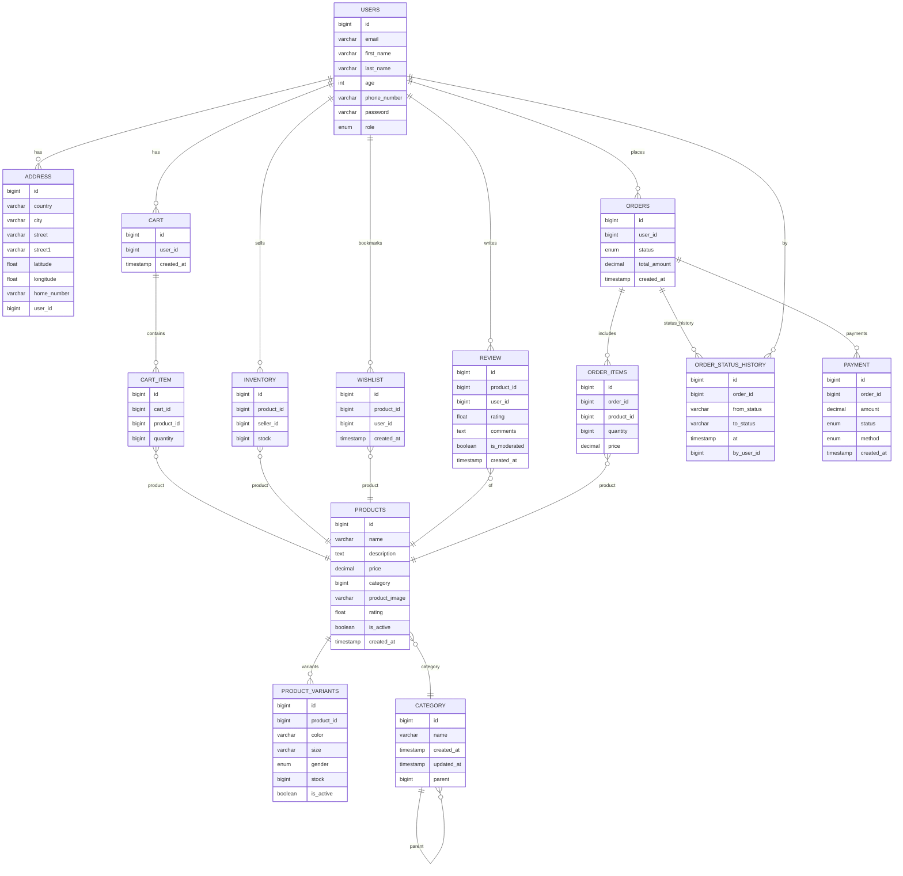

# ERD Hujjati – v1 va v2 taqqoslash

Quyida **v2 (yangilangan)** va **v1 (dastlabki)** sxemalar Mermaid.js `erDiagram` ko‘rinishida berilgan. Keyin qisqa izohlar va taqqoslash jadvali keltiriladi.

---

## 1) v1 – Eski ERD (Birinchi variant)

---

---

---

**Qisqa izohlar (v1):**

* `CATEGORY` + `SUBCATEGORY` alohida; `PRODUCTS` ikkala ustunga ulanadi.
* `WHISHLIST` jadvali noto‘g‘ri yozilgan (Whishlist) va `count` ustuni mavjud.
* `USER_ADDRESS` alohida link jadvali sifatida ishlatilgan.
* `INVENTORY.seller` → `SELLERS` jadvaliga ulanadi.

---

## 2) v2 – Yangilangan ERD (Ikkinchi variant)

---

.png>)

**Qisqa izohlar (v2):**

* `CATEGORY` o‘zini-o‘zi `parent` bilan bog‘laydi → istalgan chuqurlikdagi ierarxiya.
* `INVENTORY.seller` — v2 da `USERS`ga ulanadi (seller roli bo‘lishi kerak). Istasangiz alohida `SELLERS` jadvalini qayta kiritish mumkin.
* `WISHLIST` set ko‘rinishida: odatda `(user_id, product_id)` noyob.
* `ORDER_ITEMS.price` — xarid paytidagi **birlik narx** snapshot.

---

## 3) v3 - Eng Optimal ERD (Uchinchi variant)

---

---

**Qisqa izohlar (v3):**

- **Product Variants** qo‘shildi: `color/size/gender` darajasida SKU va **variant-level stock**. `(product_id, color, size, gender)` bo‘yicha `UNIQUE` tavsiya etiladi.
- **Review** jadvali: foydalanuvchi bahosi va sharhi, `is_moderated` bilan moderatsiya; `products.rating` ni agregat/cache sifatida yangilab borish mumkin.
- **Order Status History** saqlanadi: holatlar bo‘yicha to‘liq audit (`from_status → to_status`, `at`, `by_user_id`).
- **CATEGORY** bitta jadval, `parent` orqali self-hierarchy (cheksiz chuqurlik).
- **Inventory**: sotuvchi (`USERS` dagi seller roli) bo‘yicha mahsulot qoldig‘i; marketplace uchun mos.
- **Wishlist**: set semantikasi; `(user_id, product_id)` bo‘yicha `UNIQUE`.
- **Snapshot qoidasi**: `ORDER_ITEMS.price` xarid vaqtidagi **birlik narx** sifatida o‘zgarmas saqlanadi.

# ERD versiyalar taqqoslash (v1, v2, v3)

| Yo‘nalish        | v1                       | v2                             | v3                               |
| ---------------- | ------------------------ | ------------------------------ | -------------------------------- |
| Kategoriya       | `CATEGORY`+`SUBCATEGORY` | Bitta `CATEGORY` (self-parent) | v2 bilan bir xil                 |
| Wishlist         | `WHISHLIST` + `count`    | Toza `WHISHLIST` (set)         | v2 bilan bir xil                 |
| Inventory seller | `SELLERS` jadvali        | `USERS` (rol orqali)           | v2 bilan bir xil                 |
| Status tarixi    | Yo‘q                     | `ORDER_STATUS_HISTORY` bor     | saqlangan                        |
| Variants         | Yo‘q                     | Yo‘q                           | **`PRODUCT_VARIANTS` qo‘shildi** |
| Review           | Yo‘q                     | Yo‘q                           | **`REVIEW` qo‘shildi**           |
| Address          | `USER_ADDRESS` link      | `ADDRESS.user_id`              | saqlangan                        |

---

## 5) Biznes qoidalari (SQLsiz, konseptual)

* Savat va buyurtma miqdorlari – musbat.
* Qoldiq – manfiy bo‘lmasin.
* Buyurtma paytida **narx va manzil snapshot** qilinadi (o‘zgarmas yozuv sifatida).
* Bir foydalanuvchiga odatda **bitta faol savat** (ixtiyoriy qoida).

---

