# Near loyihasi haqida qisqacha hisobot

## 1. Kirish

Near loyihasi foydalanuvchilarga o‘zlariga eng yaqin bo‘lgan obyektlarni – dorixona, restoran, kafe, do‘kon, bankomat va boshqa xizmat ko‘rsatish nuqtalarini tezkor va qulay topishga yordam beruvchi tizimdir. Loyiha zamonaviy texnologiyalar asosida ishlab chiqilgan bo‘lib, unda geo-ma’lumotlar bilan ishlash, foydalanuvchi boshqaruvi va real vaqtli qidiruv imkoniyatlari asosiy o‘rin tutadi.

Tizimning asosiy maqsadi – foydalanuvchining lokatsiyasidan kelib chiqib, unga eng mos va eng yaqin obyektlarni aniq hisoblash hamda soddalashtirilgan interfeys orqali taqdim etishdir. Shu orqali loyiha kundalik hayotda foydalanuvchilarga vaqtni tejash va kerakli joyni topishda samarali yordamchi bo‘lib xizmat qiladi.

**Near loyihasi** foydalanuvchiga o‘ziga eng yaqin joylarni (dorixona, restoran, kafe, do‘kon, bankomat va boshqalar) topishda yordam beradi.

---

## 2. Texnologiyalar

* **Django (Python)** – asosiy backend framework sifatida
* **Django REST Framework (DRF)** – API yozish uchun
* **PostgreSQL + PostGIS** – ma’lumotlar bazasi va geo-ma’lumotlar uchun
* **Docker** – deploy va konteynerlash jarayonlarida
* **Telegram Bot API** – foydalanuvchilar bilan muloqot qilish uchun

---

## 3. Loyiha tuzilishi

Loyiha quyidagi asosiy komponentlardan tashkil topgan:

* **User boshqaruvi** – ro‘yxatdan o‘tish, login, token asosidagi autentifikatsiya
* **Place boshqaruvi** – joylarni (restoran, dorixona, kafe va boshqalar) qo‘shish, tahrirlash
* **Search History** – foydalanuvchilar tomonidan amalga oshirilgan qidiruvlarni saqlash
* **Admin panel** – admin obyektlarni boshqaradi, foydalanuvchi faoliyatini kuzatadi
* **Telegram bot** – foydalanuvchiga eng yaqin joylarni ko‘rsatadi, admin bilan chat qilish imkoniyatini beradi

---

## 4. Telegram bot

* Foydalanuvchi lokatsiya yuboradi va bot unga eng yaqin joylarni qaytaradi
* Har bir joy haqida nom, manzil, masofa va xaritada ko‘rish linki ko‘rsatiladi
* Admin va foydalanuvchi o‘rtasida chat qilish imkoniyati mavjud
* Qidiruvlar tarixi saqlanadi va statistikada aks etadi

---

## 5. Afzalliklari

* **GeoDjango + PostGIS** orqali tezkor va aniq geo-hisoblash
* **Telegram bot** yordamida foydalanuvchilar uchun qulay interfeys
* **Admin** tomonidan joylar va foydalanuvchilarni boshqarish imkoniyati
* **Docker** orqali deploy qilinishi mumkin

---

## 6. Xulosa

**Near loyihasi** foydalanuvchilarning kundalik hayotida eng yaqin obyektlarni (dorixona, restoran, kafe, do‘kon, bankomat va boshqalar) tezkor va aniq topish muammosini samarali hal qiladi. Tizim foydalanuvchi lokatsiyasiga asoslangan holda geo-hisoblashlarni amalga oshiradi va natijalarni soddalashtirilgan interfeys orqali taqdim etadi.

### Loyiha orqali:
- Foydalanuvchilar kerakli xizmatni qisqa vaqt ichida topa oladi  
- Biznes egalari o‘z obyektlarini foydalanuvchilarga yaqinlashtirish imkoniyatiga ega bo‘ladi  
- Administrator esa tizimni boshqarib, statistikani nazorat qilishi mumkin  

### Kelajak rejalar:
- To‘liq **web** va **mobil frontend** qo‘shilishi  
- Qidiruv imkoniyatlarining takomillashtirilishi  
- Foydalanuvchilar uchun yanada **interaktiv funksiyalar** yaratish  

# Near Project – ER Diagram Tavsifi

Quyida Near loyihasidagi **Entity-Relationship (ER) diagramma** matnli tarzda UML uslubida tavsiflab berilgan. Bu tasvirlash shakli vizual diagrammadan foydalanmasdan, bog‘lanishlarni matn orqali tushunishga yordam beradi.

---

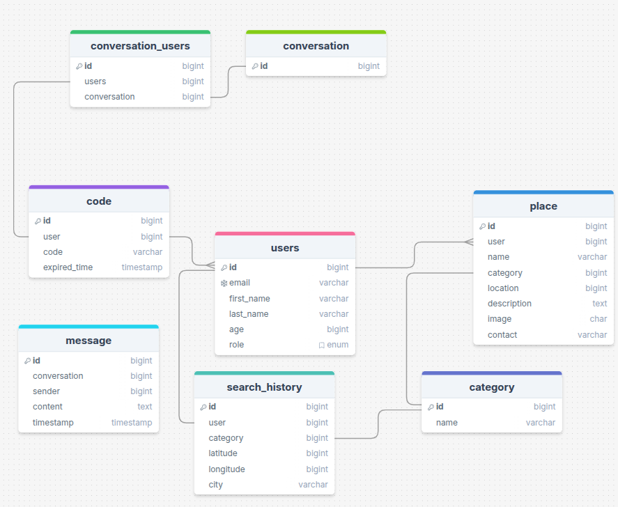

---
## Asosiy Jadvallar va Bog‘lanishlar

### 1. **Users**

* `id` (PK)
* `email`
* `first_name`
* `last_name`
* `age`
* `role`

**Bog‘lanishlar:**

* 1\:N → `place` (bitta user ko‘plab joy qo‘shishi mumkin)
* 1\:N → `search_history` (bitta user bir nechta qidiruvlar qilishi mumkin)
* 1:1 → `code` (userga yagona verification code bog‘liq)
* N\:M → `conversation` (conversation\_users jadvali orqali)

---

### 2. **Place**

* `id` (PK)
* `user` (FK → users)
* `name`
* `category` (FK → category)
* `location`
* `description`
* `image`
* `contact`

**Bog‘lanishlar:**

* N:1 → `users`
* N:1 → `category`

---

### 3. **Category**

* `id` (PK)
* `name`

**Bog‘lanishlar:**

* 1\:N → `place` (bir kategoriya bir nechta joylarga tegishli bo‘lishi mumkin)

---

### 4. **Search\_History**

* `id` (PK)
* `user` (FK → users)
* `category`
* `latitude`
* `longitude`
* `city`

**Bog‘lanishlar:**

* N:1 → `users`

---

### 5. **Code**

* `id` (PK)
* `user` (FK → users)
* `code`
* `expired_time`

**Bog‘lanishlar:**

* 1:1 → `users`

---

### 6. **Conversation**

* `id` (PK)

**Bog‘lanishlar:**

* N\:M → `users` (conversation\_users jadvali orqali)
* 1\:N → `message` (conversationda ko‘plab xabarlar bo‘lishi mumkin)

---

### 7. **Conversation\_Users** (junction table)

* `id` (PK)
* `users` (FK → users)
* `conversation` (FK → conversation)

**Bog‘lanishlar:**

* N:1 → `users`
* N:1 → `conversation`

---

### 8. **Message**

* `id` (PK)
* `conversation` (FK → conversation)
* `sender` (FK → users)
* `content`
* `timestamp`

**Bog‘lanishlar:**

* N:1 → `conversation`
* N:1 → `users` (sender sifatida)

---

## Xulosa

Ushbu ER diagramma Near loyihasining **asosiy ma’lumotlar modeli**ni ifodalaydi. Foydalanuvchi markaziy obyekt sifatida tanlangan, u joy qo‘shishi, qidiruv qilishi, chatda ishtirok etishi va xabar yuborishi mumkin. Category esa joylarni tasniflash uchun xizmat qiladi. Conversation va Message jadvallari esa chat funksiyasini amalga oshirish uchun mo‘ljallangan.
# NEAR API Hujjati / NEAR API Документация

Ushbu hujjat **NEAR loyihasi API** uchun tuzilgan bo‘lib, ikki tilda: **o‘zbek** va **rus** tillarida keltirilgan.  
API JWT orqali autentifikatsiya qilinadi.

---

# Avtorizatsiya (Auth)

## Ro‘yxatdan o‘tish / Регистрация
**POST** `/uz/api/auth/register/`  
**POST** `/ru/api/auth/register/`

**Request JSON**
```json
{
  "email": "user@example.com",
  "first_name": "Ali",
  "last_name": "Valiyev",
  "password": "Parol123",
  "password_confirm": "Parol123"
}
```

**Response (201)**
```json
{
  "id": 15,
  "email": "user@example.com",
  "first_name": "Ali",
  "last_name": "Valiyev",
  "is_active": true,
  "role": "user",
  "age": 25
}
```

---

## Login / Вход
**POST** `/uz/api/auth/login/`  
**POST** `/ru/api/auth/login/`

**Request JSON**
```json
{
  "email": "user@example.com",
  "password": "Parol123"
}
```

**Response (200)**
```json
{
  "access": "ACCESS_TOKEN_EXAMPLE",
  "refresh": "REFRESH_TOKEN_EXAMPLE"
}
```

---

## Tokenni yangilash / Обновление токена
**POST** `/uz/api/auth/login-token/refresh/`  
**POST** `/ru/api/auth/login-token/refresh/`

**Request JSON**
```json
{
  "refresh": "REFRESH_TOKEN_EXAMPLE"
}
```

**Response (200)**
```json
{
  "access": "NEW_ACCESS_TOKEN"
}
```

---

## Logout / Выход
**DELETE** `/uz/api/auth/logout/`  
**DELETE** `/ru/api/auth/logout/`

**Response (200)**  
```json
{}
```

---

## Parolni unutganda / Забыли пароль
**POST** `/uz/api/auth/forgot_password/`  
**POST** `/ru/api/auth/forgot_password/`

**Request JSON**
```json
{
  "email": "user@example.com"
}
```

**Response (201)**
```json
{
  "email": "user@example.com"
}
```

---

## Parolni tiklash / Восстановление пароля
**POST** `/uz/api/auth/restore_password/`  
**POST** `/ru/api/auth/restore_password/`

**Request JSON**
```json
{
  "code": "123456",
  "password": "NewPassword123",
  "password_confirm": "NewPassword123"
}
```

**Response (201)**
```json
{
  "code": "123456"
}
```

---

# Kategoriyalar / Категории

## Ro‘yxat olish / Получить список
**GET** `/uz/api/category/`  
**GET** `/ru/api/category/`

**Response (200)**
```json
{
  "count": 2,
  "results": [
    {"id": 1, "name": "Restoran / Ресторан"},
    {"id": 2, "name": "Do‘kon / Магазин"}
  ]
}
```

---

## Yangi kategoriya qo‘shish / Добавить категорию
**POST** `/uz/api/category/`  
**POST** `/ru/api/category/`

**Request JSON**
```json
{
  "name": "Restoran"
}
```

**Response (201)**
```json
{
  "id": 1,
  "name": "Restoran / Ресторан"
}
```

---

## Bitta kategoriya olish / Получить категорию
**GET** `/uz/api/category/{id}/`  
**GET** `/ru/api/category/{id}/`

**Response (200)**
```json
{
  "id": 1,
  "name": "Restoran / Ресторан"
}
```

---

## Kategoriyani yangilash / Обновить категорию
**PUT/PATCH** `/uz/api/category/{id}/`  
**PUT/PATCH** `/ru/api/category/{id}/`

**Request JSON**
```json
{
  "name": "Do‘kon"
}
```

**Response (200)**
```json
{
  "id": 1,
  "name": "Do‘kon / Магазин"
}
```

---

## Kategoriyani o‘chirish / Удалить категорию
**DELETE** `/uz/api/category/{id}/`  
**DELETE** `/ru/api/category/{id}/`

**Response (204)**
```json
{}
```

---

# Joylar (Place) / Места

## Joy qo‘shish / Добавить место
**POST** `/uz/api/place/`  
**POST** `/ru/api/place/`

**Request JSON**
```json
{
  "name": "Cafe Bon",
  "name_uz": "Cafe Bon",
  "name_ru": "Кафе Бон",
  "category": 2,
  "contact": "+998901234567",
  "location": {
    "latitude": 41.2995,
    "longitude": 69.2401
  },
  "description": "Chiroyli kafe",
  "description_uz": "Chiroyli kafe",
  "description_ru": "Красивое кафе"
}
```

**Response (201)**
```json
{
  "id": 10,
  "name": "Cafe Bon",
  "name_uz": "Cafe Bon",
  "name_ru": "Кафе Бон",
  "category": 2,
  "contact": "+998901234567",
  "location": {
    "latitude": 41.2995,
    "longitude": 69.2401
  },
  "distance": null,
  "created_at": "2025-08-26T12:00:00Z",
  "updated_at": "2025-08-26T12:00:00Z",
  "image_url": null,
  "description": "Chiroyli kafe",
  "description_uz": "Chiroyli kafe",
  "description_ru": "Красивое кафе"
}
```

---

## Joyni yangilash / Обновить место
**PUT/PATCH** `/uz/api/place/{id}/`  
**PUT/PATCH** `/ru/api/place/{id}/`

**Request JSON**
```json
{
  "name": "Cafe New",
  "name_uz": "Cafe Yangi",
  "name_ru": "Кафе Новое",
  "category": 2,
  "contact": "+998907654321",
  "location": {
    "latitude": 41.3100,
    "longitude": 69.2500
  },
  "description": "Yangi kafe",
  "description_uz": "Yangi kafe",
  "description_ru": "Новое кафе"
}
```

**Response (200)**
```json
{
  "id": 10,
  "name": "Cafe New",
  "name_uz": "Cafe Yangi",
  "name_ru": "Кафе Новое",
  "category": 2,
  "contact": "+998907654321",
  "location": {
    "latitude": 41.3100,
    "longitude": 69.2500
  },
  "distance": null,
  "created_at": "2025-08-26T12:00:00Z",
  "updated_at": "2025-08-27T10:00:00Z",
  "image_url": null,
  "description": "Yangi kafe",
  "description_uz": "Yangi kafe",
  "description_ru": "Новое кафе"
}
```

---

# Statistikalar / Статистика

## Aktiv foydalanuvchilar / Активные пользователи
**GET** `/uz/api/statistics/active-users/`  
**GET** `/ru/api/statistics/active-users/`

**Response (200)**
```json
{
  "count": 1,
  "results": [
    {
      "user_id": 1,
      "first_name": "Ali",
      "total_searches": 15
    }
  ]
}
```

---

## Kategoriyalar bo‘yicha qidiruv / Поиск по категориям
**GET** `/uz/api/statistics/by-category/`  
**GET** `/ru/api/statistics/by-category/`

**Response (200)**
```json
{
  "count": 1,
  "results": [
    {
      "category_id": 1,
      "category_name": "Restoran / Ресторан",
      "search_count": 50
    }
  ]
}
```

---

## Kunlik qidiruvlar / Ежедневные запросы
**GET** `/uz/api/statistics/daily-searches/`  
**GET** `/ru/api/statistics/daily-searches/`

**Response (200)**
```json
{
  "count": 1,
  "results": [
    {
      "date": "2025-01-01",
      "search_count": 100
    }
  ]
}
```

---

## Oylik xulosa / Ежемесячный отчет
**GET** `/uz/api/statistics/monthly-summary/`  
**GET** `/ru/api/statistics/monthly-summary/`

**Response (200)**
```json
[
  {
    "month": "2025-01-01",
    "user_registrations": 30,
    "category_searches": 200
  }
]
```

---

# HTTP Status Kodlari / HTTP Status Codes

| HTTP Code | Tavsif (RU)                                        | Tavsif (UZ)                               |
|-----------|----------------------------------------------------|-------------------------------------------|
| **200**   | OK – Успешный GET, PUT или POST запрос             | OK – Muvaffaqiyatli GET, PUT yoki POST so‘rovi |
| **201**   | Created – Ресурс успешно создан                    | Created – Resurs muvaffaqiyatli yaratildi  |
| **204**   | No Content – Успешное удаление                     | No Content – Muvaffaqiyatli o‘chirildi     |
| **400**   | Bad Request – Отсутствуют или неверные параметры   | Bad Request – Parametrlar yo‘q yoki noto‘g‘ri |
| **401**   | Unauthorized – Неверный или отсутствующий токен аутентификации | Unauthorized – Avtorizatsiya tokeni yo‘q yoki noto‘g‘ri |
| **403**   | Forbidden – Недостаточно прав                      | Forbidden – Ruxsat yetarli emas            |
| **404**   | Not Found – Ресурс не найден                       | Not Found – Resurs topilmadi               |
| **409**   | Conflict – Например, дублирующиеся записи           | Conflict – Masalan, dublikat yozuv mavjud  |


---
# Asosiy Ma’lumotlar Maydonlari / Основные поля данных

| Name              | Type      | Tavsif (RU)                                                      | Tavsif (UZ)                                                        |
|-------------------|-----------|------------------------------------------------------------------|--------------------------------------------------------------------|
| **id**            | integer   | Уникальный идентификатор ресурса                                | Resurs uchun noyob identifikator                                   |
| **email**         | varchar   | Email пользователя, используется для логина и связи             | Foydalanuvchi email manzili, login va aloqa uchun ishlatiladi      |
| **first_name**    | varchar   | Имя пользователя                                                | Foydalanuvchi ismi                                                 |
| **last_name**     | varchar   | Фамилия пользователя                                            | Foydalanuvchi familiyasi                                           |
| **password**      | varchar   | Пароль пользователя (хранится в зашифрованном виде)             | Foydalanuvchi paroli (shifrlangan holda saqlanadi)                 |
| **password_confirm** | varchar | Подтверждение пароля                                            | Parolni tasdiqlash                                                 |
| **access**        | varchar   | JWT Access Token                                                | JWT Access Token                                                   |
| **refresh**       | varchar   | JWT Refresh Token                                               | JWT Refresh Token                                                  |
| **role**          | varchar   | Роль пользователя (например: user, admin)                       | Foydalanuvchi roli (masalan: user, admin)                         |
| **is_active**     | boolean   | Активен ли пользователь                                         | Foydalanuvchi aktivligi                                           |
| **age**           | integer   | Возраст пользователя (если доступно)                            | Foydalanuvchi yoshi (agar mavjud bo‘lsa)                          |
| **name**          | varchar   | Название категории или места                                    | Kategoriya yoki joy nomi                                          |
| **name_uz**       | varchar   | Название на узбекском языке                                     | O‘zbek tilidagi nomi                                               |
| **name_ru**       | varchar   | Название на русском языке                                       | Rus tilidagi nomi                                                  |
| **category**      | integer   | ID категории, к которой принадлежит место                       | Joy tegishli bo‘lgan kategoriya ID’si                              |
| **contact**       | varchar   | Контактный номер или данные                                     | Kontakt raqami yoki ma’lumotlari                                  |
| **location**      | object    | Геолокация (широта и долгота)                                   | Joylashuv (latitude va longitude)                                 |
| **latitude**      | float     | Географическая широта                                           | Geografik kenglik                                                  |
| **longitude**     | float     | Географическая долгота                                          | Geografik uzunlik                                                  |
| **description**   | text      | Описание ресурса                                               | Resurs haqida ta’rif                                               |
| **description_uz**| text      | Описание на узбекском                                          | O‘zbek tilidagi ta’rif                                             |
| **description_ru**| text      | Описание на русском                                            | Rus tilidagi ta’rif                                                |
| **image_url**     | varchar   | Ссылка на изображение                                           | Rasm URL manzili                                                   |
| **created_at**    | datetime  | Дата создания                                                  | Yaratilgan sana                                                    |
| **updated_at**    | datetime  | Дата обновления                                                | Yangilangan sana                                                   |
| **distance**      | float     | Расстояние до места (если доступно)                             | Joygacha masofa (agar mavjud bo‘lsa)                               |
| **user_id**       | integer   | ID пользователя (например, в статистике активных пользователей) | Foydalanuvchi ID’si (masalan, aktiv foydalanuvchilar statistikasi) |
| **total_searches**| integer   | Количество поисковых запросов                                   | Qidiruvlar soni                                                    |
| **search_count**  | integer   | Количество запросов по категории или дате                      | Kategoriya yoki sanaga ko‘ra qidiruvlar soni                       |
| **date**          | date      | Дата для статистики (ежедневные поиски)                         | Statistikadagi sana (kunlik qidiruvlar)                            |
| **month**         | date      | Месяц для отчета (ежемесячная статистика)                       | Hisobotdagi oy (oylik statistika)                                 |
| **user_registrations** | integer | Количество регистраций пользователей за месяц                  | Oylik foydalanuvchi ro‘yxatdan o‘tishlari soni                     |
| **category_searches**  | integer | Количество поисков по категориям за месяц                      | Oylik kategoriyalar bo‘yicha qidiruvlar soni                       |


---

# Xulosa / Заключение

## O‘zbekcha:
Ushbu hujjatda **NEAR loyihasi API** uchun asosiy autentifikatsiya, kategoriyalar, joylar va statistika bo‘limlari batafsil yoritildi.  
API **JWT tokenlari** yordamida himoyalangan va foydalanuvchilarni ro‘yxatdan o‘tkazish, login qilish, parolni tiklash kabi imkoniyatlarni taqdim etadi.  
Shuningdek, **kategoriya va joylarni boshqarish (CRUD)** funksiyalari ham mavjud bo‘lib, tizim foydalanuvchilarning qidiruv faoliyatini kuzatish va **statistik hisobotlarni** (kunlik, oylik) shakllantirish imkonini beradi.  

Bu hujjat **dasturchilar** uchun qo‘llanma bo‘lib xizmat qiladi va **NEAR API bilan ishlashda yagona manba** sifatida foydalanilishi mumkin.  

---

## Русский:
В данном документе подробно описаны основные разделы **NEAR проекта API**: аутентификация, категории, места и статистика.  
API защищён с помощью **JWT токенов** и предоставляет возможности регистрации пользователей, входа в систему и восстановления пароля.  
Кроме того, реализованы функции **управления категориями и местами (CRUD)**, а также отслеживание поисковой активности пользователей и формирование **статистических отчетов** (ежедневных и ежемесячных).  

Этот документ служит руководством для **разработчиков** и может использоваться как **основной источник информации** при работе с NEAR API.  

# System and Software Requirements Analysis (SSRA)

## 1. Kirish

Bu hujjatda **Near Project (Problem Solver Web Application)** uchun tizim va dasturiy ta’minot talablari kengaytirilgan tahlili keltirilgan. Ushbu loyiha foydalanuvchilarga o‘z joylashuviga eng yaqin obyektlarni (restoran, kafe, dorixona, bankomat va boshqalar) topishda yordam beradi. Bundan tashqari, tizimda kengaytirilgan **statistik modullar** mavjud bo‘lib, ular orqali foydalanuvchilarning faoliyati, eng ko‘p qidirilgan obyektlar va vaqt bo‘yicha qidiruvlar tahlil qilinadi.

---

## 2. Tizim Talablari

### 2.1. Funksional Talablar

* Foydalanuvchilar **ro‘yxatdan o‘tishi** va **autentifikatsiyadan o‘tishi** mumkin.
* Foydalanuvchilar **lokatsiya yuborib**, o‘zlariga eng yaqin obyektlarni qidirishi mumkin.
* Qidiruv **kategoriya** bo‘yicha amalga oshiriladi (masalan, "Bank", "Mehmonxona", "Shifoxona" va hokazo).
* Foydalanuvchi o‘zining **qidiruv tarixini** ko‘rishi mumkin.
* Admin:

  * foydalanuvchilarni boshqarishi;
  * yangi obyektlarni qo‘shishi va tahrirlashi;
  * foydalanuvchi faoliyatini kuzatishi mumkin.
* Statistik modullar quyidagilarni qamrab oladi:

  * Eng ko‘p qidirilgan **kategoriya**ni aniqlash.
  * Eng faol **foydalanuvchilar**ni ko‘rsatish.
  * Jami nechta **foydalanuvchi** borligini ko‘rsatish.
  * Har bir **kunda qancha qidiruv** bo‘lganini aniqlash.

### 2.2. Nofunksional Talablar

* Tizim **yuqori yuklamalarda** ham barqaror ishlashi kerak.
* Ma’lumotlar **PostgreSQL + PostGIS** orqali ishonchli saqlanishi kerak.
* Tizim **real vaqt rejimida** qidiruv va statistikani qayta ishlashi lozim.
* Web-ilova **mobil qurilmalarda** ham qulay ishlashi kerak.
* Foydalanuvchi ma’lumotlari **xavfsizlik protokollari** orqali himoyalanishi kerak.

---

## 3. Dasturiy Talablar

* **Backend:** Django + Django REST Framework (DRF).
* **Ma’lumotlar Bazasi:** PostgreSQL + PostGIS (geo-ma’lumotlar uchun).
* **Frontend:** Hozircha Telegram bot orqali; keyinchalik React.js asosida web-interface rejalashtirilgan.
* **Statistika va Vizualizatsiya:** Chart.js, Django Admin Dashboard.
* **Deployment:** Docker (containerization), AWS / Heroku (bulutda joylashtirish).
* **Integratsiya:** Telegram Bot API orqali frontend o‘rnini bosuvchi interfeys.

---

## 4. Statistik Modullar

### 4.1. Eng ko‘p qidirilgan kategoriyalar

* Har bir qidiruv **kategoriya** bilan bog‘lanadi.
* Statistik modul **Top Categories** jadvali va grafikasi orqali ko‘rsatadi.
* Masalan: "Shifoxona" 20156 ta qidiruv, "Bank" 19907 ta qidiruv, "Mexmonhona" 20037 ta qidiruv.

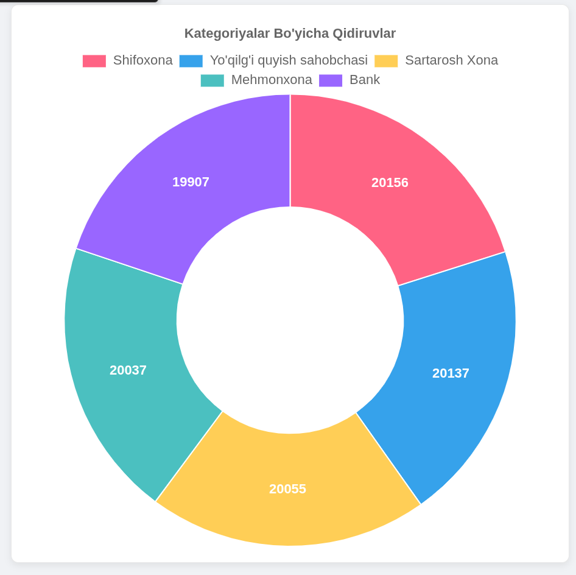

### 4.2. Eng faol foydalanuvchilar

* Qaysi foydalanuvchi eng ko‘p qidiruv qilgani sanaladi.
* Jadval orqali userlar ro‘yxati va qidiruv soni ko‘rsatiladi.
* Masalan: Benjamin (19 qidiruv), Joseph (18 qidiruv).

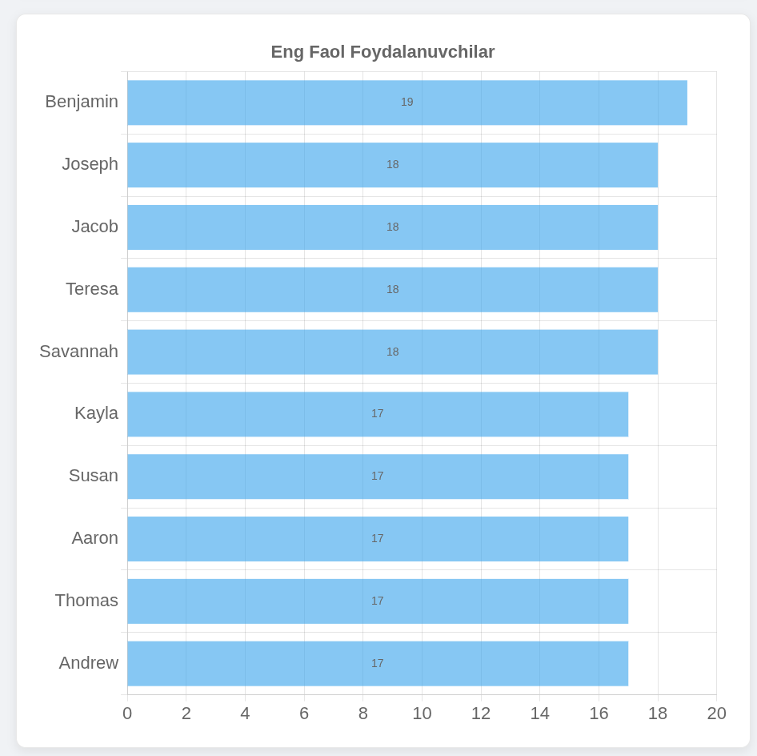

### 4.3. Foydalanuvchilar soni (Oy bo'yicha)

* Jami foydalanuvchilar soni hisoblanadi oy bo'yicha.
* Har kuni yangi foydalanuvchilar soni alohida ko‘rsatiladi.
* Bu ma’lumotlar **User Growth Chart** orqali vizualizatsiya qilinadi.

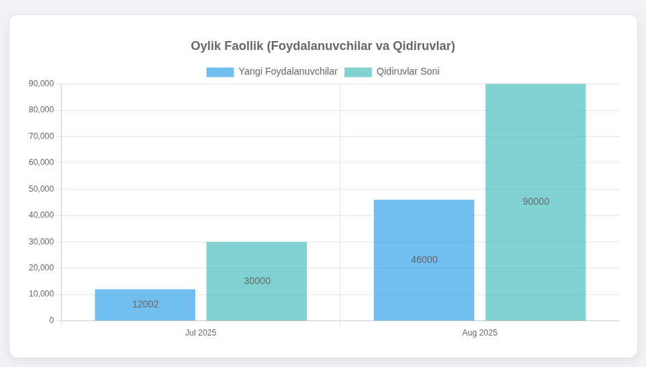

### 4.4. Kunlik qidiruvlar

* Har kuni qancha qidiruv amalga oshirilgani sanaladi.
* "Daily Searches" diagrammasi yordamida admin panelda ko‘rsatiladi.
* Masalan: 2025-07-25 kuni – 30000 qidiruv, 2025-08-03 kuni – 36000 qidiruv.

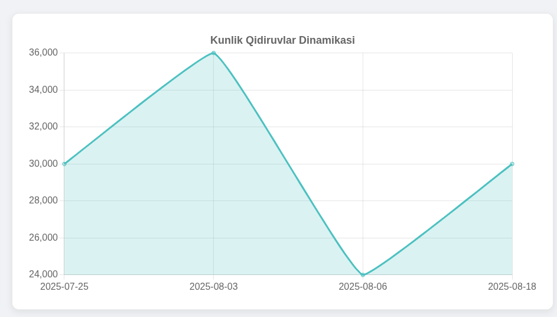

### 4.5. Qo‘shimcha Statistika (Keyingi bosqichlar uchun)

* **Joy turlari bo‘yicha mashhurlik**: qaysi turdagi obyektlar ko‘proq tanlanmoqda.
* **Foydalanuvchi retention**: qaytib kelayotgan foydalanuvchilar soni.
* **Geografik taqsimot**: qaysi hududlarda ko‘proq qidiruv amalga oshirilgan.

---

## 5. UML Diagramma (Mermaid)

### 5.1. ER Diagram

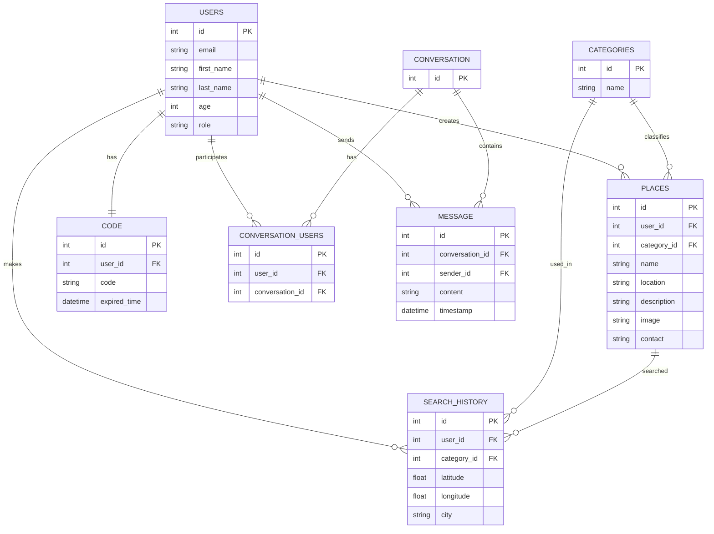

---

## 6. Xulosa

**Near loyihasi** foydalanuvchilarga geografik joylashuv asosida eng yaqin obyektlarni tez va qulay topishda yordam beradi. Statistik modullar orqali qaysi kategoriyalar eng ko‘p qidirilganini, qaysi foydalanuvchilar eng faol ekanligini, jami foydalanuvchilar sonini va kundalik qidiruvlar miqdorini aniqlash mumkin.

Bu tizim foydalanuvchi tajribasini yaxshilaydi, biznes egalari uchun foydali statistik ma’lumotlar beradi va keyingi bosqichlarda kengaytirilgan **analitika**, **geografik xaritalash** va **frontend web ilova** qo‘shilishi bilan yanada samarali bo‘ladi.
# Near Project — System Design (UZ)

Ushbu hujjat siz bergan **ERD** (Users, Place, Category, Search\_History, Code, Conversation, Conversation\_Users, Message) asosida **Telegram bot + Django + PostgreSQL(PostGIS)** arxitekturasini ta’riflaydi. Hech qanday SQL query yo‘q — faqat arxitektura, oqimlar va ishlash qoidalari. Diagrammalar **Mermaid.js**da.

---

## 1) Yuqori darajadagi arxitektura

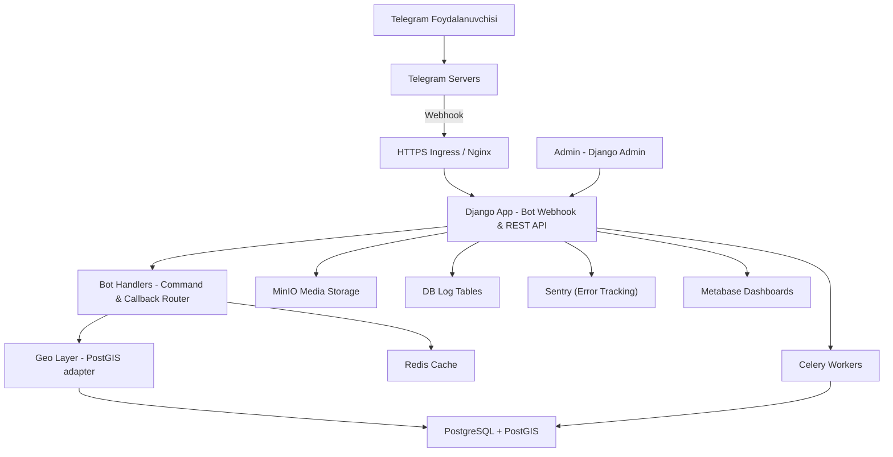

**Izoh:**

* **Webhook**: Telegram’dan kelgan update’lar `APP`ga tushadi, `HANDLERS`ga yo‘naltiriladi.
* **GEO**: radius bo‘yicha yaqin joylarni PostGIS orqali topadi.
* **CACHE**: tez-tez so‘raladigan natijalar va foydalanuvchi holatini (FSM) saqlaydi.
* **CELERY**: fon ishlari (import, media, send_code_to_email).
* **MEDIA (MinIO)**: joy rasmlarini MinIO’da saqlash (presigned URL bilan).
* **LOGS (DB)**: ilova loglari PostgreSQL ichidagi jadvallarda.

---

## 2) ERD (siz bergan model asosida)

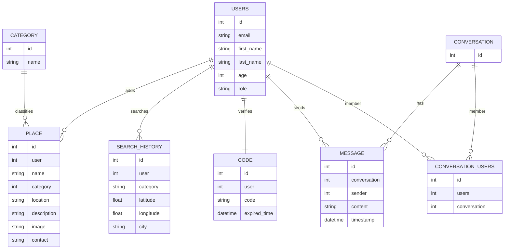

**Moslik:** ERD aynan siz yuborgan tavsifga tayanadi. `Place.location` qiymati **PostGIS Point** sifatida saqlanishi tavsiya etiladi (masofa hisoblari uchun qulay).

---

## 3) Asosiy ish oqimlari (sequence)

### 3.1 “Yaqin joylarni topish” oqimi

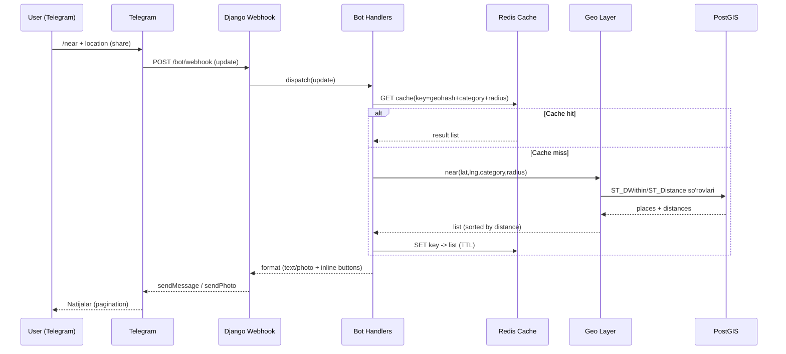

### 3.2 Joy qo‘shish/yangilash (Admin oqimi)

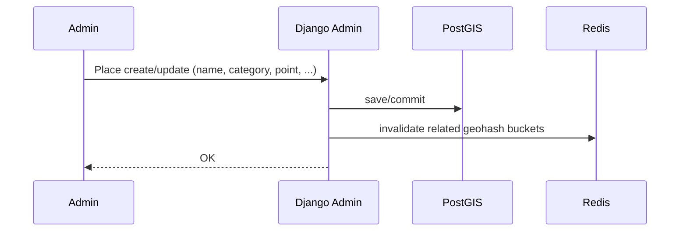

### 3.3 Chat/Conversation oqimi

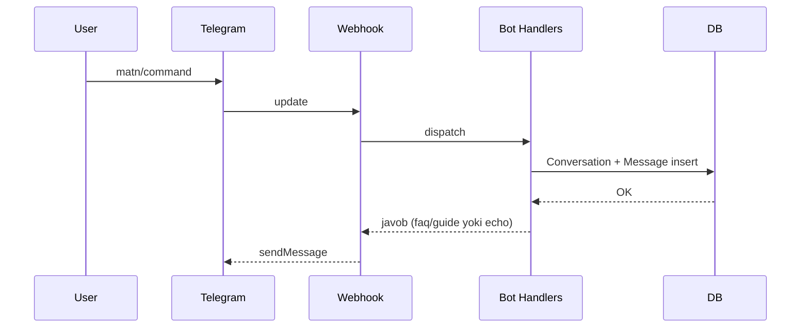

---

## 4) Bot UX va FSM

* **/start**: til tanlash (UZ/RU/EN) → izoh va ruxsat (location).
* **/near**: kategoriya inlinelar (restoran, bank, shifoxona, ATM…) → **location** so‘rash.
* **Radius**: 500m / 1km / 3km tugmalari.
* **Natija kartalari**: nom, masofa (m/km), manzil/telefon, **Yo‘nalish** (maps link).
* **Pagination**: 1 tadan sahifalash (prev/next callback\_data).
* **/help**: qisqa qo‘llanma.

**FSM (holat mashinasi) Redis’da):**

* `awaiting_category` → `awaiting_location` → `awaiting_radius` → `showing_results`.

---

## 5) Geo strategiya (PostGIS)

* `Place.location`ni **geometry(Point, 4326)** yoki **geography(Point, 4326)** sifatida saqlash.
* Qidiruvda **distance** ni hisoblash

---

## 6) API qatlam (botdan tashqari, ixtiyoriy public)

* `POST /bot/webhook` — Telegram update.
* `GET /api/categories` — kategoriyalar.
* `GET /api/conversations/{id}/messages` — chat tarixini ko‘rsatish (agar ichki UI bo‘lsa).

**Autentikatsiya:** bot uchun ichki token; tashqi mijozlar bo‘lsa JWT (optional).

---

## 7) Kesh va fon ishlari

* **Redis**: geoqidiruv va FSM uchun.
* **Celery**: User register bo'lganda userga code jo'natish.

---

## 8) Xavfsizlik

* **Webhook secret** + HTTPS. Telegram IP range yoki imzo tekshiruvi.
* **Admin**: Auth.

---

## 9) Skeyl va ishlash

* PostGIS: **GiST/SP-GiST** indekslar (Point ustunida) — radius qidiruv tezligi.
* O‘qish ko‘p bo‘lsa: read-replica va cache.
* Monitoring: **Sentry** (xatolar, alertlar), **Metabase** (dashboard/hisobotlar), **Nginx access log**; oddiy health‑check endpoint.
* Docker + CI/CD: image’lar, `.env` sirlar (bot token, DB DSN), healthcheck.

---

## 10) Jadval-maqsad xaritalash (Traceability)

* **Users**: autentikatsiya/avtorizatsiya, chat va authorlik.
* **Place**: yaqin joylar, manzil, aloqa, rasm.
* **Category**: qidiruv filtri va tasnif.
* **Search\_History**: so‘rovlarni tahlil qilish, UX takomillashtirish.
* **Code**: verifikatsiya (bir martalik/vaqtli kodlar).
* **Conversation/Conversation\_Users**: chatxona struktura.
* **Message**: xabar tarixi (audit, analitika).

---

## 11) Ochiq qarorlar

* `Search_History.category`: matnmi yoki FKmi? (FK bo‘lsa yaxshiroq izchillik.)
* `Place.image`: bitta maydonmi yoki ko‘p rasm? (kelajakda `Place_Photo` joriy etish mumkin.)
* `location` turi: **geography** (metrik masofa) yoki **geometry** (projeksiyaga bog‘liq) — tanlash ishlatish holatiga bog‘liq.
* Conversation’lar endi bot ichidami yoki tashqi interfeys ham bo‘ladimi? (Audit/analitika talablari.)

---

### Yakuniy xulosa

Arxitektura **Telegram → Webhook → Django → PostGIS** zanjiri atrofida qurilgan. Kesh va fon ishlari ishlashni tezlashtiradi, PostGIS esa aniq va tez geoqidiruvni ta’minlaydi. ERD’dagi har bir jadval aniq funksional bo‘lim bilan bog‘langan va o‘lcham oshishi bilan Redis/Celery/Monitoring yordamida barqarorlik saqlanadi.

---

## 11.1) Loglar — DB ichida (Amaliy dizayn)

Siz aytgandek loglar **PostgreSQL** ichida saqlanadi. Quyidagi oddiy model tavsiya qilinadi (SQLsiz):

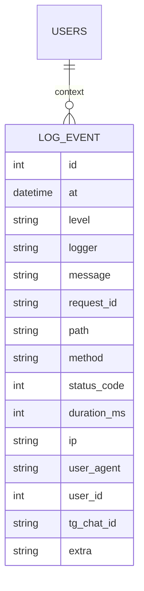
---

## 11.2) Rasmlar — MinIO (Media)

**Saqlash siyosati:**

* **Bucket**: `near` (yoki env bo‘yicha: `near`, `near`).
* **ACL**: **private**. Foydalanuvchiga rasm berish **presigned GET** yoki **reverse proxy** (Nginx) orqali.
* **Yuklash:** admin panel/servisdan **presigned PUT**; bot uchun faqat o‘qish.
* **DB’da saqlash:** `Place.image` — URL/yo‘l; ko‘p rasm kerak bo‘lsa, `Place_Photo(place_id, url, is_primary, sort_order)`ni qo‘shish.

**CDN/Keşlash:**

* Nginx static cache yoki tashqi CDN bilan rasmlarni tez yetkazish.
* Fayl o‘lchamlarini Celery’da qayta ishlash (thumb/preview) va natijani MinIOga yozish.

---

## 11.3) Monitoring va Audit yangilanishi

* **Sentry**: asosiy xatolik kuzatuvchi (stack traces, breadcrumbs, release health, alert rules: email/Telegram webhook).
* **Logs (DB)**: yuqoridagi `LOG_EVENT` jadvallariga yoziladi; trendlar va tahlil uchun saqlash/partitsiya/retenşn siyosati qo‘llanadi.
* **Dashboard/Hisobotlar (Metabase)**:  Search\_History jadvallari asosida:

  * soatlik/darajadagi ERROR soni,
  * o‘rtacha `duration_ms` va endpointlar bo‘yicha taqsimot,
  * kategoriya/radius bo‘yicha qidiruvlar, natijalar soni,
  * foydalanuvchi faolligi (Search\_History).
* **Rejalashtirilgan hisobotlar**: Eng Active Userlar, Kun bo'yicha Searchlar, Categorylar bo'yicha statistica, Userlar va Searchlarni oylik statistica.
* **Health-check**: `/health` endpoint (DB, Redis, MinIO tekshiruvlari). Muvaffaqiyatsiz bo‘lsa — Telegram alert.
* **Audit**: Muhim CRUD’lar (Place create/update, Conversation add) uchun `extra`ga kontekst yozish yoki alohida `AUDIT_EVENT` jadvallari.

## 11.4) Oqimlarga qo‘shimcha eslatmalar Oqimlarga qo‘shimcha eslatmalar

* **Near qidiruv**: natijalar yuborilganda logga `request_id`, `lat/lng`, `distance`, `category`, `count` yozish – keyin ishlashni tahlil qilish oson bo‘ladi.
* **Media oqimi**: presigned URL generatsiyasi va muvaffaqiyatli yuklash/ko‘rish holatlarini `LOG_EVENT`ga INFO sifatida qo‘yish.
