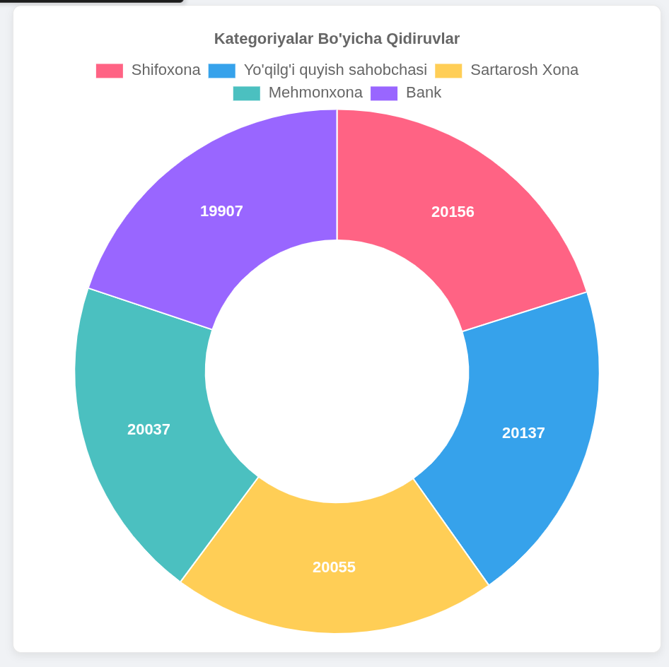
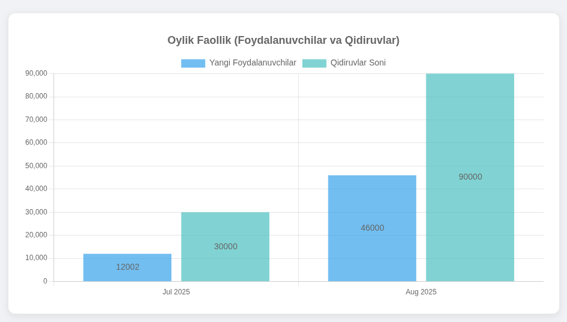

# System and Software Requirements Analysis (SSRA)

## 1. Kirish

Bu hujjatda **Near Project (Problem Solver Web Application)** uchun tizim va dasturiy ta’minot talablari kengaytirilgan tahlili keltirilgan. Ushbu loyiha foydalanuvchilarga o‘z joylashuviga eng yaqin obyektlarni (restoran, kafe, dorixona, bankomat va boshqalar) topishda yordam beradi. Bundan tashqari, tizimda kengaytirilgan **statistik modullar** mavjud bo‘lib, ular orqali foydalanuvchilarning faoliyati, eng ko‘p qidirilgan obyektlar va vaqt bo‘yicha qidiruvlar tahlil qilinadi.

---

## 2. Tizim Talablari

### 2.1. Funksional Talablar

* Foydalanuvchilar **ro‘yxatdan o‘tishi** va **autentifikatsiyadan o‘tishi** mumkin.
* Foydalanuvchilar **lokatsiya yuborib**, o‘zlariga eng yaqin obyektlarni qidirishi mumkin.
* Qidiruv **kategoriya** bo‘yicha amalga oshiriladi (masalan, "Bank", "Mehmonxona", "Shifoxona" va hokazo).
* Foydalanuvchi o‘zining **qidiruv tarixini** ko‘rishi mumkin.
* Admin:

  * foydalanuvchilarni boshqarishi;
  * yangi obyektlarni qo‘shishi va tahrirlashi;
  * foydalanuvchi faoliyatini kuzatishi mumkin.
* Statistik modullar quyidagilarni qamrab oladi:

  * Eng ko‘p qidirilgan **kategoriya**ni aniqlash.
  * Eng faol **foydalanuvchilar**ni ko‘rsatish.
  * Jami nechta **foydalanuvchi** borligini ko‘rsatish.
  * Har bir **kunda qancha qidiruv** bo‘lganini aniqlash.

### 2.2. Nofunksional Talablar

* Tizim **yuqori yuklamalarda** ham barqaror ishlashi kerak.
* Ma’lumotlar **PostgreSQL + PostGIS** orqali ishonchli saqlanishi kerak.
* Tizim **real vaqt rejimida** qidiruv va statistikani qayta ishlashi lozim.
* Web-ilova **mobil qurilmalarda** ham qulay ishlashi kerak.
* Foydalanuvchi ma’lumotlari **xavfsizlik protokollari** orqali himoyalanishi kerak.

---

## 3. Dasturiy Talablar

* **Backend:** Django + Django REST Framework (DRF).
* **Ma’lumotlar Bazasi:** PostgreSQL + PostGIS (geo-ma’lumotlar uchun).
* **Frontend:** Hozircha Telegram bot orqali; keyinchalik React.js asosida web-interface rejalashtirilgan.
* **Statistika va Vizualizatsiya:** Chart.js, Django Admin Dashboard.
* **Deployment:** Docker (containerization), AWS / Heroku (bulutda joylashtirish).
* **Integratsiya:** Telegram Bot API orqali frontend o‘rnini bosuvchi interfeys.

---

## 4. Statistik Modullar

### 4.1. Eng ko‘p qidirilgan kategoriyalar

* Har bir qidiruv **kategoriya** bilan bog‘lanadi.
* Statistik modul **Top Categories** jadvali va grafikasi orqali ko‘rsatadi.
* Masalan: "Shifoxona" 20156 ta qidiruv, "Bank" 19907 ta qidiruv, "Mexmonhona" 20037 ta qidiruv.



### 4.2. Eng faol foydalanuvchilar

* Qaysi foydalanuvchi eng ko‘p qidiruv qilgani sanaladi.
* Jadval orqali userlar ro‘yxati va qidiruv soni ko‘rsatiladi.
* Masalan: Benjamin (19 qidiruv), Joseph (18 qidiruv).


### 4.3. Foydalanuvchilar soni (Oy bo'yicha)

* Jami foydalanuvchilar soni hisoblanadi oy bo'yicha.
* Har kuni yangi foydalanuvchilar soni alohida ko‘rsatiladi.
* Bu ma’lumotlar **User Growth Chart** orqali vizualizatsiya qilinadi.



### 4.4. Kunlik qidiruvlar

* Har kuni qancha qidiruv amalga oshirilgani sanaladi.
* "Daily Searches" diagrammasi yordamida admin panelda ko‘rsatiladi.
* Masalan: 2025-07-25 kuni – 30000 qidiruv, 2025-08-03 kuni – 36000 qidiruv.


### 4.5. Qo‘shimcha Statistika (Keyingi bosqichlar uchun)

* **Joy turlari bo‘yicha mashhurlik**: qaysi turdagi obyektlar ko‘proq tanlanmoqda.
* **Foydalanuvchi retention**: qaytib kelayotgan foydalanuvchilar soni.
* **Geografik taqsimot**: qaysi hududlarda ko‘proq qidiruv amalga oshirilgan.

---

## 5. UML Diagramma (Mermaid)

### 5.1. Use Case Diagram

```mermaid
usecaseDiagram
  actor User
  actor Admin

  User --> (Search Places)
  User --> (View Categories)
  User --> (Check Search History)

  Admin --> (Manage Users)
  Admin --> (Manage Places)
  Admin --> (View Statistics)

  (View Statistics) --> (Top Categories)
  (View Statistics) --> (Top Users)
  (View Statistics) --> (Daily Searches)
  (View Statistics) --> (Total Users)
```

### 5.2. ER Diagram


---

## 6. Xulosa

**Near loyihasi** foydalanuvchilarga geografik joylashuv asosida eng yaqin obyektlarni tez va qulay topishda yordam beradi. Statistik modullar orqali qaysi kategoriyalar eng ko‘p qidirilganini, qaysi foydalanuvchilar eng faol ekanligini, jami foydalanuvchilar sonini va kundalik qidiruvlar miqdorini aniqlash mumkin.

Bu tizim foydalanuvchi tajribasini yaxshilaydi, biznes egalari uchun foydali statistik ma’lumotlar beradi va keyingi bosqichlarda kengaytirilgan **analitika**, **geografik xaritalash** va **frontend web ilova** qo‘shilishi bilan yanada samarali bo‘ladi.
