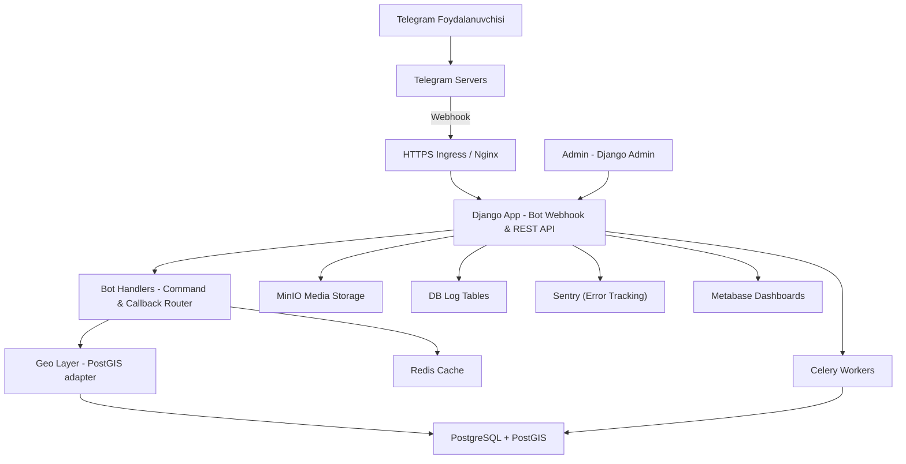
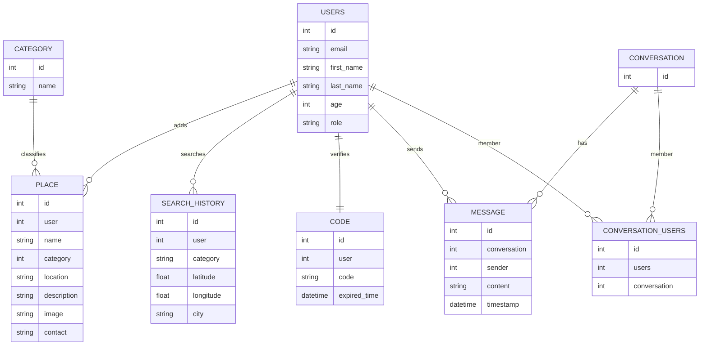
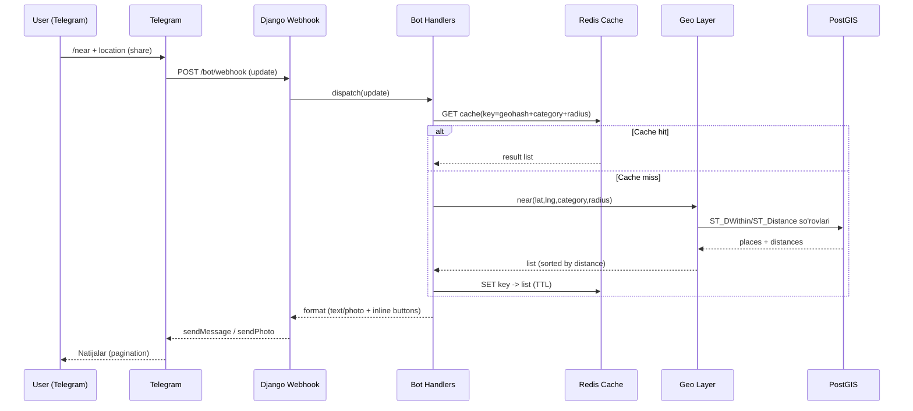
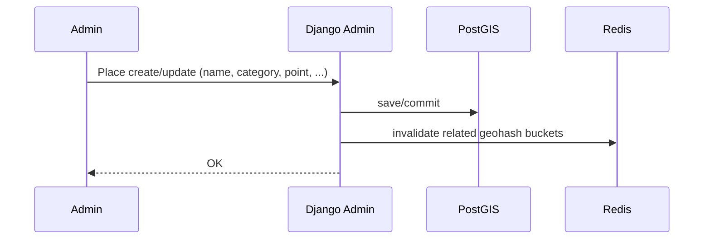
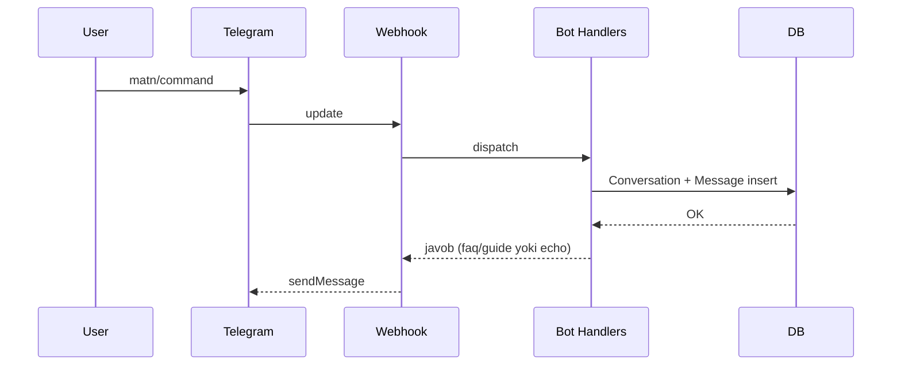
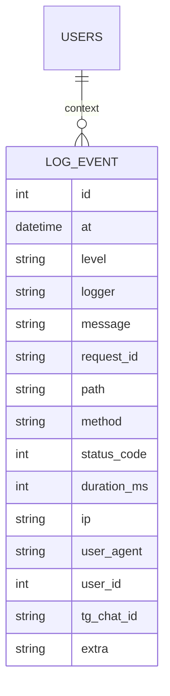

# Near Project — System Design (UZ)

Ushbu hujjat siz bergan **ERD** (Users, Place, Category, Search\_History, Code, Conversation, Conversation\_Users, Message) asosida **Telegram bot + Django + PostgreSQL(PostGIS)** arxitekturasini ta’riflaydi. Hech qanday SQL query yo‘q — faqat arxitektura, oqimlar va ishlash qoidalari. Diagrammalar **Mermaid.js**da.

---

## 1) Yuqori darajadagi arxitektura

**Izoh:**

* **Webhook**: Telegram’dan kelgan update’lar `APP`ga tushadi, `HANDLERS`ga yo‘naltiriladi.
* **GEO**: radius bo‘yicha yaqin joylarni PostGIS orqali topadi.
* **CACHE**: tez-tez so‘raladigan natijalar va foydalanuvchi holatini (FSM) saqlaydi.
* **CELERY**: fon ishlari (import, media, notifikatsiya, reindex).
* **MEDIA (MinIO)**: joy rasmlarini MinIO’da saqlash (presigned URL bilan).
* **LOGS (DB)**: ilova loglari PostgreSQL ichidagi jadvallarda.

---

## 2) ERD (siz bergan model asosida)

**Moslik:** ERD aynan siz yuborgan tavsifga tayanadi. `Place.location` qiymati **PostGIS Point** sifatida saqlanishi tavsiya etiladi (masofa hisoblari uchun qulay).

---

## 3) Asosiy ish oqimlari (sequence)

### 3.1 “Yaqin joylarni topish” oqimi

### 3.2 Joy qo‘shish/yangilash (Admin oqimi)

### 3.3 Chat/Conversation oqimi

---

## 4) Bot UX va FSM

* **/start**: til tanlash (UZ/RU/EN) → izoh va ruxsat (location).
* **/near**: kategoriya inlinelar (restoran, bank, shifoxona, ATM…) → **location** so‘rash.
* **Radius**: 500m / 1km / 3km tugmalari.
* **Natija kartalari**: nom, masofa (m/km), manzil/telefon, **Yo‘nalish** (maps link), **Saqlash** (kelajakda Favorites qo‘shmoqchi bo‘lsangiz) yoki **Kontakt**.
* **Pagination**: 5 tadan sahifalash (prev/next callback\_data).
* **/help**: qisqa qo‘llanma.

**FSM (holat mashinasi) Redis’da):**

* `awaiting_category` → `awaiting_location` → `awaiting_radius` → `showing_results`.

---

## 5) Geo strategiya (PostGIS)

* `Place.location`ni **geometry(Point, 4326)** yoki **geography(Point, 4326)** sifatida saqlash.
* Qidiruvda **radius** cheklovi va **masofa bo‘yicha tartib**.
* Kesh kaliti: `geohash(lat,lng,precN)+category+radiusBucket`. TTL: 2–10 daqiqa.
* Shaharga ko‘ra filtrlash (agar kerak bo‘lsa) uchun `Search_History.city` yoki reverse-geocode natijalaridan foydalanish.

---

## 6) API qatlam (botdan tashqari, ixtiyoriy public)

* `POST /bot/webhook` — Telegram update.
* `GET /api/categories` — kategoriyalar.
* `GET /api/conversations/{id}/messages` — chat tarixini ko‘rsatish (agar ichki UI bo‘lsa).

**Autentikatsiya:** bot uchun ichki token; tashqi mijozlar bo‘lsa JWT (optional).

---

## 7) Kesh va fon ishlari

* **Redis**: geoqidiruv va FSM uchun.
* **Celery**: bulk import (OSM/Overpass), mediani qayta o‘lchash, eski keshlarni tozalash, eslatmalar.
* Kesh invalidatsiyasi: Place o‘zgarsa — tegishli geohash segmentlarini tozalash.

---

## 8) Xavfsizlik

* **Webhook secret** + HTTPS. Telegram IP range yoki imzo tekshiruvi.
* **Rate limiting**: foydalanuvchi/telegram\_id bo‘yicha (Redis lua/limiter).
* **Admin**: RBAC.

---

## 9) Skeyl va ishlash

* PostGIS: **GiST/SP-GiST** indekslar (Point ustunida) — radius qidiruv tezligi.
* O‘qish ko‘p bo‘lsa: read-replica va cache.
* Monitoring: **Sentry** (xatolar, alertlar), **Metabase** (dashboard/hisobotlar), **Nginx access log**; oddiy health‑check endpoint.
* Docker + CI/CD: image’lar, `.env` sirlar (bot token, DB DSN), healthcheck.

---

## 10) Jadval-maqsad xaritalash (Traceability)

* **Users**: autentikatsiya/avtorizatsiya, chat va authorlik.
* **Place**: yaqin joylar, manzil, aloqa, rasm.
* **Category**: qidiruv filtri va tasnif.
* **Search\_History**: so‘rovlarni tahlil qilish, UX takomillashtirish.
* **Code**: verifikatsiya (bir martalik/vaqtli kodlar).
* **Conversation/Conversation\_Users**: chatxona struktura.
* **Message**: xabar tarixi (audit, analitika).

---

## 11) Ochiq qarorlar

* `Search_History.category`: matnmi yoki FKmi? (FK bo‘lsa yaxshiroq izchillik.)
* `Place.image`: bitta maydonmi yoki ko‘p rasm? (kelajakda `Place_Photo` joriy etish mumkin.)
* `location` turi: **geography** (metrik masofa) yoki **geometry** (projeksiyaga bog‘liq) — tanlash ishlatish holatiga bog‘liq.
* Conversation’lar endi bot ichidami yoki tashqi interfeys ham bo‘ladimi? (Audit/analitika talablari.)

---

### Yakuniy xulosa

Arxitektura **Telegram → Webhook → Django → PostGIS** zanjiri atrofida qurilgan. Kesh va fon ishlari ishlashni tezlashtiradi, PostGIS esa aniq va tez geoqidiruvni ta’minlaydi. ERD’dagi har bir jadval aniq funksional bo‘lim bilan bog‘langan va o‘lcham oshishi bilan Redis/Celery/Monitoring yordamida barqarorlik saqlanadi.

---

## 11.1) Loglar — DB ichida (Amaliy dizayn)

Siz aytgandek loglar **PostgreSQL** ichida saqlanadi. Quyidagi oddiy model tavsiya qilinadi (SQLsiz):

**Tavsiyalar:**

* **Indekslar:** `at DESC`, `level`, `request_id`, (path, method), `status_code`, `user_id`.
* **Partitsiya:** oy/hafta bo‘yicha **range partitioning** – katta hajmda arzon saqlash va tez o‘chirish.
* **Retention:** masalan, **90 kun** operativ, eski loglar arxivga (s3/minio) yoki tozalanadi.
* **PII**: shaxsiy ma’lumotlarni mask qilish; payload’larni `extra`ga minimal yozish.
* **Vizualizatsiya:** Grafana/Metabase orqali to‘g‘ridan‑to‘g‘ri SQLsiz ko‘rish (query builder). Alertlar Prometheus eksporterlari yoki periodik tekshiruvlar orqali.

---

## 11.2) Rasmlar — MinIO (Media)

**Saqlash siyosati:**

* **Bucket**: `near-media` (yoki env bo‘yicha: `near-dev-media`, `near-prod-media`).
* **Object key tuzilmasi:** `places/<place_id>/<uuid>.jpg`;
  **thumbnail**: `places/<place_id>/thumb/<uuid>.jpg`.
* **ACL**: **private**. Foydalanuvchiga rasm berish **presigned GET** yoki **reverse proxy** (Nginx) orqali.
* **Yuklash:** admin panel/servisdan **presigned PUT**; bot uchun faqat o‘qish.
* **Lifecycle:** thumb/orphan fayllar uchun avtomatik o‘chirish qoidalari (masalan, 180 kun). Versiyalash ixtiyoriy.
* **DB’da saqlash:** `Place.image` — URL/yo‘l; ko‘p rasm kerak bo‘lsa, `Place_Photo(place_id, url, is_primary, sort_order)`ni qo‘shish.

**CDN/Keşlash:**

* Nginx static cache yoki tashqi CDN bilan rasmlarni tez yetkazish.
* Fayl o‘lchamlarini Celery’da qayta ishlash (thumb/preview) va natijani MinIOga yozish.

---

## 11.3) Monitoring va Audit yangilanishi

* **Sentry**: asosiy xatolik kuzatuvchi (stack traces, breadcrumbs, release health, alert rules: email/Telegram webhook).
* **Logs (DB)**: yuqoridagi `LOG_EVENT` jadvallariga yoziladi; trendlar va tahlil uchun saqlash/partitsiya/retenşn siyosati qo‘llanadi.
* **Dashboard/Hisobotlar (Metabase)**: LOG\_EVENT va domen jadvallari asosida:

  * soatlik/darajadagi ERROR soni,
  * o‘rtacha `duration_ms` va endpointlar bo‘yicha taqsimot,
  * kategoriya/radius bo‘yicha qidiruvlar, natijalar soni,
  * foydalanuvchi faolligi (Search\_History).
* **Rejalashtirilgan hisobotlar**: Metabase schedule (email/webhook) yoki cron yordamida haftalik PDF/CSV.
* **Health-check**: `/health` endpoint (DB, Redis, MinIO tekshiruvlari). Muvaffaqiyatsiz bo‘lsa — Telegram alert.
* **Audit**: Muhim CRUD’lar (Place create/update, Conversation add) uchun `extra`ga kontekst yozish yoki alohida `AUDIT_EVENT` jadvallari.

## 11.4) Oqimlarga qo‘shimcha eslatmalar Oqimlarga qo‘shimcha eslatmalar

* **Near qidiruv**: natijalar yuborilganda logga `request_id`, `lat/lng`, `distance`, `category`, `count` yozish – keyin ishlashni tahlil qilish oson bo‘ladi.
* **Media oqimi**: presigned URL generatsiyasi va muvaffaqiyatli yuklash/ko‘rish holatlarini `LOG_EVENT`ga INFO sifatida qo‘yish.
* **Cache invalidatsiyasi**: Place o‘zgarganda tegishli geohash segmentlari tozalanishi bilan birga, `LOG_EVENT`ga sababi/identifikatori yozilsin.
